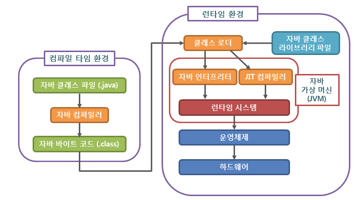
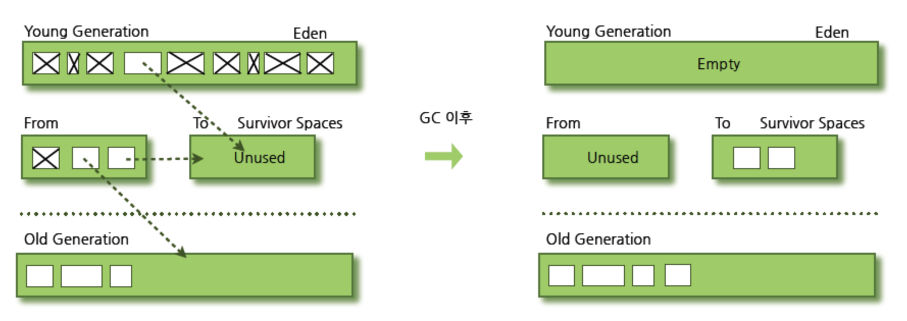

# 자바 메모리, 컴파일, GC

## 날짜: 2025-01-24

### 스크럼
- 학습 목표 1 :

### 오늘의 도전 과제와 해결 방법
- 

### 새로 배운 내용
### 자바의 메모리 영역과 컴파일과정

- 메모리 영역
    
    메리 영역에는 힙, 스택, 메소드(메타스페이스), 네이티브 메소드, PC 레지스터가 있다
    
    - 힙 :  클래스,  등 저장 / GC에 의해 정리됨
    - 스택 : 지역 변수, 등 저장
    - 메소드 : 클래스, 인터페이스 등 저장
    - 네이티브 메소드 : 자바가 아닌 다른 언어로 쓰인 코드 저장
    - PC 레지스터 : 다음 실행될 코드 위치 저장 / Program Counter
- 컴파일 과정
    
    자바는 컴파일 언어와 인터프리터 언어의 특징을 모두 가지고 있다.
    
    - 컴파일 언어
        
        코드 실행 전에 전체 코드를 컴파일하여 실행 파일을 준비한다. / 번역본을 .exe에 저장 후 런타임에 한 번에 실행 / 오류가 있으면 실행되지 않는다. / 빠르다
        
        > 컴파일 :  소스 코드를 기계어로 번역
        > 
    - 인터프리터 언어
        
        한 줄 씩 읽어가며 실행한다. / 번역하고 버린다 / 오류가 나오기 전까지는 실행된다. / 느리다
        
    
    <aside>
    💡
    
    🙋‍♀️ 인터프리터 언어는 느린데 왜 나왔을까??
    
    1. 디버깅 용이 : 헤비한 프로그램을 오류가 나기 전까지 실행 가능하다! 어쨋든 돌아는 간다..
    2. 이식성 : 플랫폼 독립성이 좋아서 운영체제에 상관없이 돌아간다.
    3. 메모리 감소 : 실행 파일(.exe)이 생성되지 않아서 메모리 사용이 줄어든다.
    </aside>
    
    그럼 컴파일 과정을 알아보자.
    
    
    
    1. JAVAC : .java 파일을 .class(바이트 코드) 로 변환
    2. class loader : 바이트 코드를 가져와 로딩, 링크, 초기화를 거쳐 JVM에서의 실행 준비
    3. JVM : 실행
        1. 인터프리터
        2. JIT 컴파일러  : 코드의 hotness를 판단해서 hotness가 높은 코드는 미리 컴파일해 저장해 놓는다.
    
    <aside>
    💡
    
    JIT 컴파일러
    
    (Just In Time)
    
    인터프리터 언어의 속도 성능 문제를 해결하기 위해 도입되었다. 코드의 hotness를 판단해 hotness가 높은 코드는 미리 컴파일해 저장해 놓는다.
    
    </aside>
    

### 가비지 컬렉션(Garbage Collection)

> 불필요한 메모리를 정리함
> 

그중에서도 힙에 올라와있는 메모리 정리를 담당한다.

힙에는 두 가지 영역이 있다.

- young 영역  : 새로운 객체
    - eden 영역  : 새로 할당된 객체 / 1개
    - survivor 영역  : GC에 의해 한 번 이상 살아남은 객체
- old 영역  : 자주 쓰이는 객체

어느 영역에서 GC가 작동하는지에 따라 분류된다. young에서 작동하면 minor GC, old 에서 자동하면 major GC

**Minor GC**

eden 영역이 꽉 차면 실행 / 빠르다

1. eden에 새 객체 생성
2. eden 영역 꽉 참 →  minor GC 실행
    1. eden 영역의 사용하지 않는 객체 메모리 해제
    2. 살아남은 객체 survivor로 이동
3. a,b 반복하다가 survivor 영역이 꽉 차면, 다른 survivor 영역으로 이동
4. 1~3 반복 후에도 살아남은 객체 old 영역으로 이동

**Major GC**

old 영역이 꽉 차면 실행 / 느리다

### JVM관점에 static을 왜 조심해서 써야할까?

<aside>
💡

static?

생성된 클래스 인스턴스 모두에 공유되는 멤버 키워드

</aside>

1. 메모리 문제
2. thread safe 하지 않음
    
    하나의 thread에서 static 변수 값을 바꾸면 다른 thread에서도 이 값을 바꾸기 위한 동기화를 위한 추가 과정이 필요하다
    
3. 생성과 소멸
    
    프로그램이 로딩될 때 생성되고, JVM이 내려갈 때 소멸.

### 오늘의 회고
- 

### 참고 자료 및 링크

