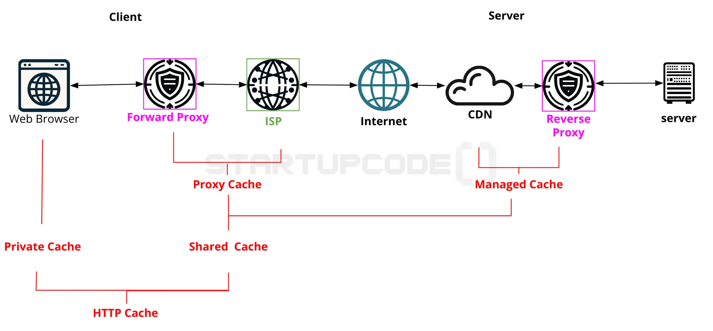

# 웹 구조, HTTPS, TCP/UCP, API

## 날짜: 2025-02-12

### 스크럼
- 학습 목표 1 : 웹 응용

### 새로 배운 내용
#### Internet
전 세계의 컴퓨터 네트워크들이 상호 연결되어 정보를 공유하는 거대한 네트워크 시스템  
인터넷 > 웹(웹은 인터넷에서 돌아가는 하나의 서비스)
- <동작 방식>  

1. 인트라넷에서의 요청
    > 인트라넷  
       = 특정 집단을 위한 페쇄적인 내부 네트워크
    -------------
    > 엑스트라넷  
       = 인트라넷에서 협업 등을 위해 일부를 열어 놓음
2. 게이트웨이를 통한 이동
    > 게이트웨이  
       = 인트라넷에서 나가는 트래픽을 인터넷으로 라우팅  
       -> 보안검사, 프로토콜 변환 수행  
       >> 트래픽  
            =  서버의 데이터 전송량  
    -------------
    >> 라우터  
    = 컴퓨터 네트워크 간에 데이터 패킷을 전송하는 네트워크 장비
3. 외부 네트워크 접속
4. 응답의 반환

##### 게이트웨이(Gateway)
1. 데이터 수신
2. 프로토콜 변환
3. 주소 변환 : IP주소나 식별정보 변환
4. 보안 및 필터링 : 불필요하거나 위험한 트래픽 차단
5. 데이터 전송 : 변환된 데이터 패킷을 올바른 목적지로 안내
6. 피드백 및 확인

#### 웹 구조
<동작 방식>  

1. 도메인 이름 입력
2. (프록시 서버 통과)  
3. DNS 조회  
    > DNS(Domain Name Systerm)  
        = 사람이 이해하기 쉬운 도메인 주소를 ip 주소로 변환
4. 클라이언트와 서버의 3-way handshake  
    : 내가 왔음을 알려줌
5. 클라이언트와 서버의 TLS handshake  
    : for 안전한 연결
6. 안전한 HTTPS 통신  

##### CDN
(Contents Delivery Network)  
전 세계에 분산된 서버 네트워크를 통해 웹 콘텐츠를 캐싱하여 사용자에게 빠르게 제공하는 시스템  
<동작 방식>
1. 요청 경로 최적화   
클라이언트의 요청이 가장 가까운 CDN 서버로 라우팅
2. 콘텐츠 전송&캐싱  
CDN 서버에 콘텐츠가 있으면 바로 보내기. 없으면 찾아서 캐싱 후 보냄.
3. 콘텐츠 업데이트 및 관리

##### 시스템 아키텍처
|    | 모놀리식 아키텍처 | MSA 아키텍처 |
|---|---|---|
|정의|하나의 서버가 모든 서비스를 관리|여러 서버에서 각 서비스가 운영됨|
|장점|- 관리가 용이|- 한 서비스에서 문제가 발생해도 다른 서비스에는 영향 X|
|||- 장애에 강함|
|||- 확장성과 유연성 높음|
|단점|- 오류 발생 시 전체 시스템 마비|- 각 서비스의 API와 버전 관리 복잡|

#### TCP
(Transmission Control Protocol)  
인터넷 상에서 데이터를 안정적으로, 순서대로, 에러 없이 교환할 수 있는 통신 프로토콜  
⇒ **안정적** & **신뢰가능**

<동작 방식>  
1. 연결 설정 (3-way handshake)
    > **3-way handshake**  
        대화하기 전에 송신자와 수신자 간에 준비 됐는지 확인   
        1. SYN(synchronize):  
        - 클라이언트→ 서버 연결 요청을 보내고 자신의 초기 시퀀스 번호를 알림  
    ---
    >2.SYN-ACK(acknowlodge):  
        - 서버가 요청 수락, 클라이언트 시퀀스 번호+1&자신의 초기 시퀀스 번호를 포함한 패킷을 보냄  
        >> 패킷  
        = 보내는 데이터  
    >> 시퀀스 번호  
        = 패킷의 정보를 담은 번호  
    ---
    >3.ACK:  
        - 클라이언트가 서버의 시퀀스 번호+1을 확인 응답으로 보냄  
    ---
    >4.연결 성립!
    
2. 데이터 전송  

    연결이 성립되면 데이터 전송 시작
    
3. 신뢰성 있는 전송  
    - 진짜 전송 되었는지 확인 응답(ACK)를 통해 확인  
    - 수신자는 데이터 받으면 송신자에게 ACK 보냄  
    - 일정 시간 내에 ACK가 도착하지 않으면 재전송
    
4. 흐름 제어 및 혼잡 제어
    
    → for, 데이터 손실 최소화 &  전송 효율 최대화
    
5. 연결 종료
    
    서로 연결 종료할 준비 됨을 확인하고 4단계의 핸드세이크를 통해 연결 종료

#### UCP
(User Datagram Protocol)  
빠르고 간단한 통신을 위해 연결 설정 없이 데이터를 전송하는 네트워크 프로토콜  
⇒ **비연결성** & **비신뢰성**

- 데이터가 도착했는지 확인 ㄴㄴ
- 순서 보장 ㄴㄴ

ex) 실시간 스트리밍, 실시간 데이터 분석, 게임, DNS

<동작 방식>  
1. 데이터그램 전송
    > **데이터그램**  
    목적지 주소와 포트 정보 포함
    
2. 비신뢰성 및 비연결성
    - 데이터가 손실되거나 순서가 바뀌어도 복구하지 X
3. 빠른 전송
    - 프로토콜 오버헤드 줄임

#### HTTPS
(HyperText Transfer Protocol Secure)
<서버가 인증서를 받는 과정>

1. 서버의 신원 확인 및 키 생성
2. CSR 생성
    
    <aside>
    💡
    
    CSR(Certificate Signing Request) = 인증서 서명 요청
    
    </aside>
    
3. CA에 CSR 제출
4. 인증서 발급
5. 인증서 설치
6. 클라이언트가 서버의 인증서 검증
    
    → 인증서가 유효하다면 서버의 공개키를 신뢰하고 사용
    

<클라이언트와 서버가 소통하는 과정>

1.  CA에게 클라이언트 인증서 발급
2. 클라이언트가 서버에게 인증서 요청
3. 클라이언트는 서버의 인증서 확인
4. 서버의 공개키로 문서의 암호화
5. 네트워크를 통해 서버에게 암호화된 문서 전달
6. 서버는 비밀키로 문서 복호화 & 검증
7. 대칭키 교환

#### 대칭키 교환 (TLS 핸드쉐이킹)

> **대칭키**  
암호화/복호화에 사용하는 키가 동일한 암호화 방식
     → 빠르지만 키 교환이 어렵다
---
> **비대칭키**  
공개키로 암호화 & 비밀키로 복호화  
    → 안전하지만 느림

<과정>  
1. 클라이언트의 대칭키 생성
2. 대칭키의 안전한 전달
3. 네트워크를 통해 서버에게 대칭키 전송
4. 대칭키를 사용한 통신

    → 서버는 서버의 비밀키를 사용하여 클라이언트의 대칭키를 복호화  
    

##### HTTPS 사용 방법
웹 서버에서 SSL 도는 TLS 인증서를 설치해 HTTPS 활성화  
⇒ 즉, **HTTPS = HTTP + (SSL or TLS)**

#### HTTP Cache
##### Cache
데이터 또는 명령어를 미리 복사해 두고, 빠르게 접근할 수 있도록 하는 **임시 저장소**

브라우저에 가까울 수록 더 개인적인 내용 포함.  

EX) 동일한 파일 반복해서 다운로드  
- 웹 브라우저의 부담  :  매번 다운로드.. ㅠㅜ
- 웹 서버의 부담  :  트래픽과 부하 증가  
⇒ 캐!시!사!용

처음 다운로드 했을 때 캐시에 저장하고, 다음에 파일 다운로드 요청 시 캐시된 파일만 빠르게 불러오기

→ 다운로드 대기 시간 줄음, 네트워크 전송량 줄음

<캐시의 유형>
- Private Cache = **내꺼**
    
    → 개인 사용자의 브라우저 내에 구현됨
    
    - 네트워크 전체 트래픽이나 서버 부하 감소에는 영향 노노
- Shared Cache = **여러 사용자꺼**
    
    → 여러 사용자가 접근 가능한 캐시.
    
    → 프록시 서버나 CDN에 의해 구현됨
    
- Proxy Cache
    
    → 인터넷 서비스 제공 업체나 대규모 네트워크 내에서 구현 됨
    
- Managed Cache
    
    → 특정 서비스에 의해 관리 됨
    

<동작 방식>

1. 요청 캐시 검사
2. 만료 검사
    
    캐시되 리소스가 만료되었는지 확인
    
3. 조건부 요청
    
    if (캐시된 리소스가 만료 or 유효 ㄴㄴ), then 서버에 조건부 요청을 보내어 리소스가 변경되었는지 확인
    
4. 새 리소스 저장
5. 캐시 제어

#### API
 “(내가 만드는) 애플리케이션과 (이미 만들어진) 애플리케이션이 서로 통신할 수 있도록 정의한 명세서” 

<중요성>
- 서로 다른 시스템이나 애플리케이션 간에 데이터를 교환하고 기능을 공유하기 위해서

<사용 방법>
- 개발자가 API 문서를 참고하여 미리 정의된 명령어나 프로토콜을 활용해 특정 기능을 실행하거나 데이터를 교환할 수 있음

#### REST API
(REpresentational State Transfer Application Programming Interface)  
REST 규칙을 지킨 API

> REST 규칙  
= REpresentational  
= State  
= Transfer

### 오늘의 도전 과제와 해결 방법
- 

### 오늘의 회고
- 배운 내용이 진짜 진짜 많다...... 복습 할 수 있겠지.?

### 참고 자료 및 링크

