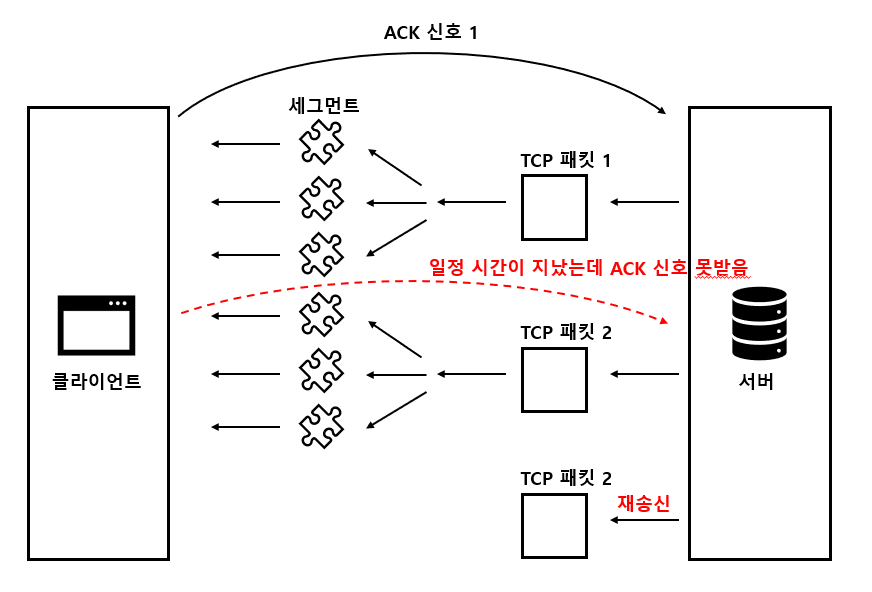
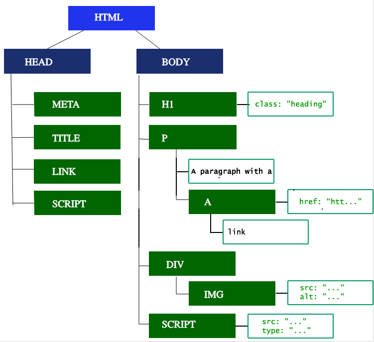

# 브라우저의 동작 방식

## 날짜: 2025-02-14

### 스크럼
- 학습 목표 1 : 브라우저의 동작 방식 조사
- 학습 목표 2 : js 기초 강의 수강

### 새로 배운 내용
#### 브라우저의 동작 방식
##### 1. 탐색
= 사용자가 url 입력, 링크 클릭 등의 이벤트를 발생하여 요청 전송

1. DNS 조회
**https://example.com(도메인 주소)   →   ##.###.##.##(IP 주소)**
    - 캐싱되어있지 않은 경우에만 실행
    - 서버와의 거리가 멀면 지연 시간 발생

    > **DNS(Domain Name Server)**
      사람이 이해하기 쉬운 도메인 주소와 실제 ip 주소의 맵핑 관계를 저장하고 있는 서버
    
    </aside>
    
    
    
    
2. TCP handshake
(Transmission Control Protocol)
    
    **TCP-1.**  연결 설정 (3-way handshake)
    
    > 3-way handshake  
     = 대화하기 전에 송신자와 수신자 간에 준비 됐는지 확인
    
    > 1.  SYN(synchronize):  
          클라이언트→ 서버 연결 요청을 보내고 자신의 초기 시퀀스 번호를 알림
        
   >  2. SYN-ACK(acknowlodge):  
        서버가 요청 수락, 클라이언트 시퀀스 번호+1&자신의 초기 시퀀스 번호를 포함한 패킷을 보냄  
        >> **패킷** = 보내는 데이터  
           **시퀀스 번호** = 패킷의 정보를 담은 번호

    > 3. ACK:  
        클라이언트가 서버의 시퀀스 번호+1을 확인 응답으로 보냄
        
    > 4. 연결 성공!
    
3. TLS 협상
    1. 클라이언트의 대칭키 생성
    2. 대칭키의 안전한 전달
    3. 네트워크를 통해 서버에게 대칭키 전송
    4. 대칭키를 사용한 통신
    
    

##### 2. 응답

클라이언트는 초기 HTTP `GET` request를 보냄 → 서버의 응답

**TCP-2.**  데이터 전송

연결이 성립되면 TCP 패킷 전송 시작 → 전송하면서 세그먼트로 분할 됨.

**TCP-3.**  신뢰성 있는 전송

- 진짜 전송 되었는지 확인 응답(ACK)를 통해 확인
- 수신자는 데이터 받으면 송신자에게 ACK 보냄
- 일정 시간 내에 ACK가 도착하지 않으면 재전송

**TCP-4.**  흐름 제어 및 혼잡 제어

→ for, 데이터 손실 최소화 &  전송 효율 최대화

- 혼잡도를 제어하기 위해 TCP Slow Start 사용

> **TCP Slow Start**  

TCP는 패킷의 순서를 보장하고, TCP 패킷은 전송되면서 세그먼트로 분할 된다.

클라이언트는 이를 받을 때 순서 보장 때문에, ACK 패킷 형태로 승인 받는다.

하지만, 이때 각 세그먼트마다 ACK를 받으면 부하 발생.

이때 사용하는게 TCP Slow Start

:  최대 네트워크 대역폭이 결정될 때까지 전송되는 데이터의 양을 점차적으로 늘리고 네트워크 부하가 높은 경우 전송되는 데이터의 양을 줄임

- 전송할 세그먼트 수는 혼잡 윈도우(CWND)의 값에 의해 제어됨.
- ACK 수신 시 → CWND 증가 → 송신 세그먼트 수 증가
- ACK 미수신 시 → CWND 감소 → 송신 세그먼트 수 감소

##### 3. 구문 분석

네트워크를 통해 받은 데이터를 DOM이나 CSSOM으로 바꾸는 단계

1. DOM 트리 구축
    
    HTML을 처리하여 문서의 내용을 설명하는 DOM 트리 구축
    
    = 구문 분석기
    
    
    
2. 프리로드 스캐너
    
    이미지, 링크 등과 같은 논 블로킹 자원 발견 시, 미리 자원 요청
    
    → 구문 분석기가 자원을 필요로 할 때 바로바로 쓸 수 있게.
    
3. CSSOM 구축
4. JS 컴파일
5. 접근성 트리(AOM) 구축
    
    보조 기기가 사용하는 트리.
    

##### 4. 렌더

DOM + CSSOM = Render tree(Style tree)

- 스타일          : 렌더 트리 생성
- 레이아웃      : 레이아웃 실행 후 리플로우 실행

    > **레이아웃**  
    :  렌더 트리에 있는 모든 노드의 너비, 높이, 위치를 결정 & 페이지에서 각 객체의 크기와 위치를 계산
    
    > **리플로우**  
    :  페이지의 일부분이나 전체 문서에 대한 크기나 위치에 다시 결정  
       ex) 이미지 크기

    
- 페인트      : 그리기 →  레이어로 그룹화해서 그릴 수 도 있음.
- (합성)        : 레이어들이 올바른 순서로 화면에 그려지는 지 & 정확한 렌더링 보장

##### 5. 상호작용

사용자가 I/O를 통해 소통

> BUT, 화면을 볼 수 있지만 JS 파일 준비가 지연된다면, 상호작용에 지연시간이 걸림
> 

##### 6. 종료

**TCP-5.**  연결 종료

서로 연결 종료할 준비 됨을 확인하고 4단계의 핸드세이크를 통해 연결 종료

#### JS 기초
- 리스트 : const 변수명 = []
- 리스트 요소 삭제 : list.splice(idx,num);
- 
### 오늘의 도전 과제와 해결 방법
- 

### 오늘의 회고
- 

### 참고 자료 및 링크

