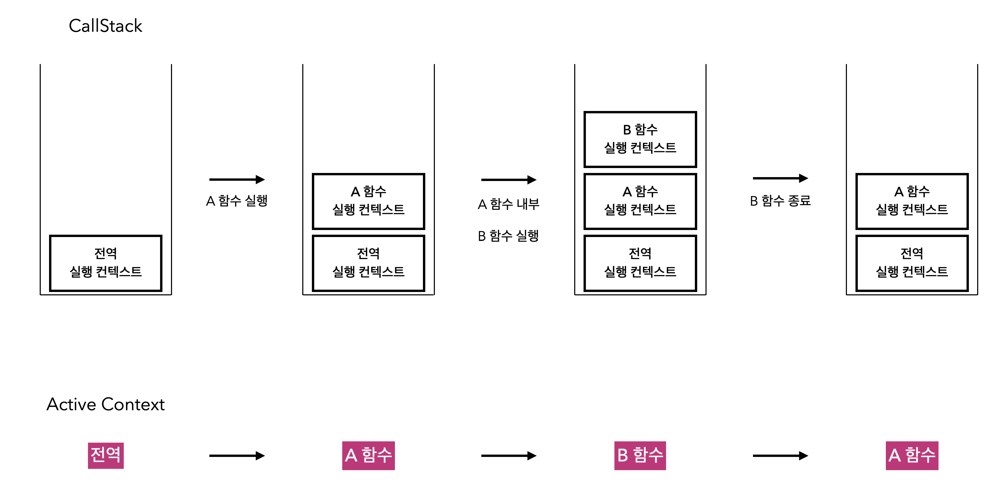

# 제목

## 날짜: 2025-02-24

### 스크럼
- 학습 목표 1 :

### 오늘의 도전 과제와 해결 방법
- 

### 새로 배운 내용
# 실행 context

js에서 코드 실행 환경을 담은 변수

함수 실행할 때만 호출된다.

Variable Environment(변수 환경)

- 현재 실행 컨텍스트 안에서 선언된 변수와 함수에 대한 정보를 담고 있는 환경
- 최초 실행 컨텍스트 생성 시점의 스냅샷을 유지하는 특징
    - 정적인 특성, 변수 환경에서 등록된 식별자 정보는 실행 단계 변경되지 않는다.
    - 코드 실행 전에 미리 결정된 벼수랑 함수 정보를 담고 있는 정적인 저장소 역할

Lexical Environment(렉시컬 환경)

- 스코프 체인, 변수, 함수의 실제 값에 대한 정보를 담고 있는 환경 맵
- 변수 환경이랑 비슷하게 변수랑 함수 정보를 갖조 있지만 실행단계 동적으로 변한다.
    
    Envioronment Record(환경 레코드)
    
    - 현재 스코프에 선언된 식별자랑 식별자에 바인딩 값을 key-value 형태로 저장하는 객체
    
    Outer Environment Reference (외부 환경 참조)
    
    - 상위 스코프의 Lexical Environment을 가리키는 참조값

This Binding(This 바인딩)

- this 키워드에 바인딩된 객체를 가리키는 값

### js의 실행 컨텍스트가 쌓이는 방식

1. 전역 실행 컨텍스트는 맨 밑바닥에
2. 함수가 실행될 때마다 함수 실행 컨텍스트가 쌓인다
3. 함수가 완료되면 없어짐.(pop)

# 프로토타입

**객체가 생성**될 때 기본적으로 갖게 되는 **상속받을 수 있는** 속성과 메서드들의 집합

ex) 클래스 

→ 객체에게 초기 상태나 기능 제공

- 자식 객체는 프로토타입을 재조정할 수 있다.
- 함수를 생성하면 자동으로 생긴다

# 모듈 번들러

여러 개의 js 모듈과 그 의존성을 하나 또는 몇 개의 파일로 묶는 도구

- import/require 브라우저에서 해석하지 못함
- 최근에는 브라우저에서도 esm을 지원한다
- 성능 최적화, 트리셰이킹, 코드 스플리팅, 폴리필 등을 도와준다
- 라이브 리로드, HMR

### 오늘의 회고
- 

### 참고 자료 및 링크

