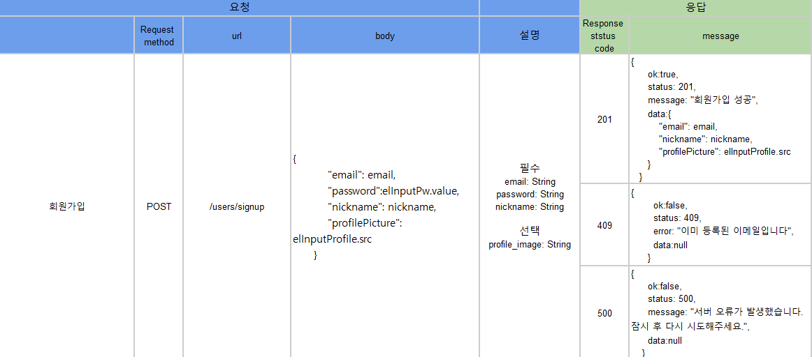

# api 명세서 작성하기

## 날짜: 2025-03-08

### 스크럼
- 학습 목표 1 :

### 오늘의 도전 과제와 해결 방법
- 

### 새로 배운 내용
# API

(Application Programming Interface)

소프트웨어 애플리케이션이 서로 **통신**하여 **데이터, 특징 및 기능을 교환**할 수 있도록 하는 일련의 **규칙** 또는 **프로토콜**

- 클라이언트와 서버 사이의 요청 및 응답에서 API 통신이 사용된다.
- API는 이 연결을 설정하는 bridge
- 어려운 기술을 요하는 기능을 직접 개발하지 않고 편리하게 사용 가능

# API 명세서

API에 대한 설명을 자세하게 적어놓은 문서

HTTP Method 종류(GET, POST, PUT, PATCH, DELETE…), 엔드포인트, 데이터, HTTP status 등을 포함한다.

### **📌 HTTP 주요 메서드 정리**

| 메서드 | 설명 | 주요 기능 | 예시 |
| --- | --- | --- | --- |
| 🔍 **GET** | 서버에서 데이터를 가져올 때 사용 | 조회(Read) | 게시글 목록 가져오기 |
| 📩 **POST** | 새로운 데이터를 서버에 추가할 때 사용 | 생성(Create) | 회원가입, 새 글 작성 |
| 🛠 **PUT** | 기존 데이터를 완전히 덮어쓸 때 사용 | 덮어쓰기(Update) | 프로필 정보 변경 (전체 수정) |
| ✏️ **PATCH** | 기존 데이터의 일부만 수정할 때 사용 | 부분 수정(Partial Update) | 닉네임 value만 변경하기 |
| ❌ **DELETE** | 데이터를 삭제할 때 사용 | 삭제(Delete) | 게시글 삭제, 회원 탈퇴 |

### **📌 API 설계에서 자주 사용하는 HTTP 상태 코드 정리**

| 상태 코드 | 의미 | 설명 | 예시 |
| --- | --- | --- | --- |
| ✅ **200 OK** | 요청 성공 | 요청이 정상적으로 처리됨 | 데이터 조회 성공 (GET) |
| ✅ **201 Created** | 리소스 생성 성공 | 요청을 처리하고 새로운 리소스를 생성함 | 회원가입 완료 (POST) |
| 🔄 **204 No Content** | 요청 성공 (응답 본문 없음) | 요청이 성공했지만 반환할 데이터가 없음 | 삭제 완료 (DELETE) |
| ⚠️ **400 Bad Request** | 잘못된 요청 | 요청 파라미터가 잘못되었거나 필수 값이 누락됨 | 필수 입력값 누락 |
| 🚫 **401 Unauthorized** | 인증 필요 | 로그인이 필요한 API에 인증 없이 접근 | 토큰 없이 사용자 정보 조회 시도 |
| ❌ **403 Forbidden** | 권한 없음 | 권한이 없는 사용자가 접근을 시도함 | 일반 사용자가 관리자 페이지 접근 |
| 🔍 **404 Not Found** | 요청한 리소스 없음 | 존재하지 않는 URL이나 데이터를 요청함 | 없는 게시글 조회 |
| 🔄 **409 Conflict** | 리소스 충돌 | 중복된 데이터로 인해 요청이 거부됨 | 중복된 이메일로 회원가입 시도 |
| ⚙️ **500 Internal Server Error** | 서버 오류 | 서버 내부에서 예기치 않은 오류 발생 | 데이터베이스 연결 오류 |

# API 설계도 작성법

## <요청>

1. Request Syntax
    
    API의 형태, 구조에 대한 정의
    
    ex) API가 사용하는 메서드 & 요청 URL의 형태 & 코드 예제 제공
    
2. Request Header
    
    요청에 대한 추가 정보
    
    ex) 메시지의 총 길이, 형식, 인증을 위한 정보 등…
    
3. Request Element
    
    요청의 실제 메시지 (→GET에는 없음)
    
    ex) 파라미터, 파라미터의 유형, 필수 여부, 설명, 제약 사항 등…
    

## <응답>

1. Response Element
    
    API 요청에 대한 결과값 확인
    
    ex) 성공 여부, 조회 정보
    

## 예시.

### 오늘의 회고
- 

### 참고 자료 및 링크

