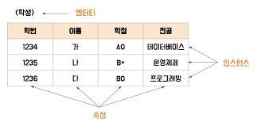
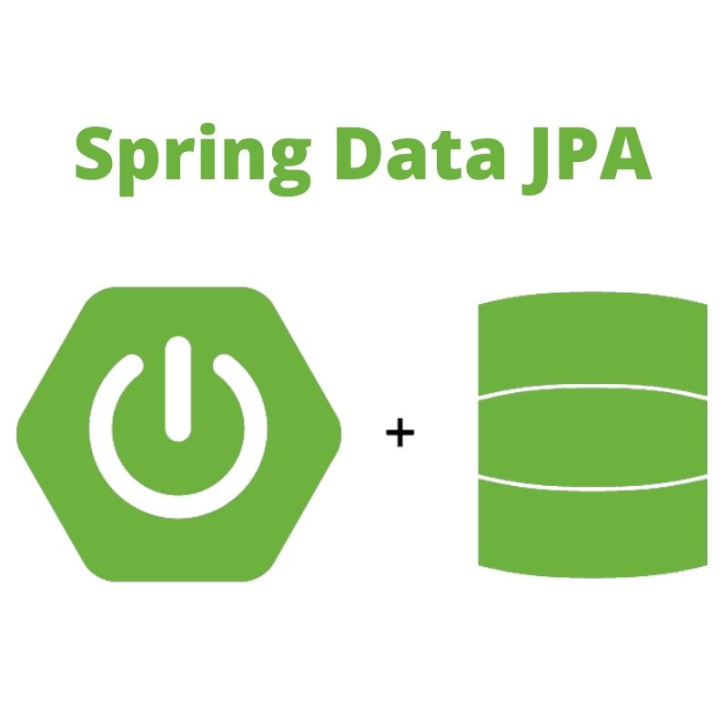

# 영속성 컨텍스트, JPA, JPQL, 엔티티 그래프

## 날짜: 2025-03-19

### 스크럼
- 학습 목표 1 :

### 오늘의 도전 과제와 해결 방법
- 

### 새로 배운 내용
# 영속성 컨텍스트

(Persistent Context)

= 엔티티를 저장하고 관리하는 저장소


**엔티티(Entity**(실체, 객체)**)**

= 데이터베이스 내에서 변별 가능한 객체. 

= 정보를 저장할 수 있는 어떤 것

= 업무상 관리가 필요한 것


- 1차 캐시, 더티체킹, 지연 로딩 등을 제공하고 SQL 작성 부담을 줄여줌.

## 로딩

조인 관계에 따라서 기본으로 지연로딩이 잡혀있는 거도 있고, 기본으로 즉시 로딩이 잡혀있는 거도 있다.

### 지연 로딩(Lazy Loading)

### 즉시 로딩(Eager Loading)

## 캐시

### 1차 캐시

= 영속성 컨텍스트 내부에 존재하는 캐시

→ 트랜젝션 단의 캐시

→ 엔티티 매니저 하나 당 하나의 1차 캐시

- 쓰기 지연 버퍼

### 2차 캐시

(공유 캐시)

→ 어플리케이션 전체에서의 캐시(범위가 더 넓음)

- 동시성 제어나 캐시 무효화 전략 등을 신중히 설계해야 함
- 읽기 전용 데이터, 자주 변경되지 않는 데이터에 적절
- 너무 많이 사용하면 메모리 문제 발생

# Spring JPA(Java Persistence API)

자바 진영에서 ORM(Object-Relational Mapping) 기술 표준으로 사용되는 인터페이스의 모음

**실제적으로 구현된것이 아니라** 구현된 클래스와 매핑을 해주기 위해 사용되는 **프레임워크**


## 연관 관계 매핑

= 객체 지향 설계와 RDB 사이의 불일치를 해결(=ORM)하는 핵심



객체 지향 설계와 RDB 사이의 불일치?

= **The Object-Relational Impedance Mismatch**

객체 모델을 RDB에 저장할 때 두 패러다임의 불일치에서 나오는 문제.

- **객체 (사용되는 곳 중심):** 관련 데이터와 기능을 하나의 객체 안에 모아 캡슐화하여 관리.
- **RDB (테이블 중심):** 데이터 정규화를 통해 데이터를 여러 테이블로 나누고, 테이블 간의 관계를 설정하여 관리.


외래키(Foreign Key)

= 두 테이블을 서로 연결하는 데 사용되는 키

부모 테이블 - 자식 테이블(외래키🔑)

<주의 사항>

1. 외래키 값은 **NULL**이거나 **부모 테이블의** **기본키 값**과 동일해야한다
2. 부모 테이블의 기본키, 고유키를 외래키로 지정할 수 있다.
    1. 부모 테이블의 기본키, 고유키가 여러개의 컬럼으로 이루어져 있다면 부모가 가진 기본키, 고유키 컬럼을 원하는 개수만큼 묶어서 외래키로 지정할 수 있다. 


📌<매핑 전략>

### 일대일(@OneToOne)

- 양쪽 엔티티 중 하나가 **주 테이블**(외래키🔑)이 됨
- 외래키는 unique 해야 함.
- 회원과 회원 상세 정보 등 1:1로 나누고 싶을 때 사용

**단방향**

= 한 쪽 엔티티에서만 다른 엔티티를 참조

- 💻코드와 설명
    
    > Member 엔티티와 MemberDetail 엔티티는 일대일 관계이다.
    > 
    - 핵심 코드
        
        ```java
        ....
        //해당 클래스가 db 테이블과 매핑되는 엔티티임을 선언하는 어노테이션
        @Entity
        //"members"라는 테이블과 매핑되도록 명시적으로 설정
        @Table(name = "members")
        public class Member {
            //id가 기본키(pk)임을 명시하는 어노테이션(id는 어디서든 항상 pk이다. 어노테이션에 Id가 들어가서가 아니라 그냥 원래 그렇다. @Name한다고 해서 name 변수가 pk가 되지 않는다. 그건 그냥 오류가 난다.)
            @Id
            //pk 자동 생성. GenerationType.IDENTITY: -> pk auto-increment
            @GeneratedValue(strategy = GenerationType.IDENTITY)
            private Long id;  //pk
            
            private String name;
        
            //Member가 MemberDetail의 주인이며, 외래 키는 detail_id 컬럼으로 관리됨
            //일대일. CascadeType.ALL -> 부모 엔티티에서 발생하는 모든 작업(삽입,수정,삭제...)가 자식 엔티티에 자동 전파
            @OneToOne(cascade = CascadeType.ALL)
            //외래키(foreign key)가 "detail_id"이다.
            @JoinColumn(name = "detail_id")
            private MemberDetail detail;
        
            //생성자, getter, setter
            ...
        }
        ```
        
        매핑된 디비 예시(**members**)
        
        | id(PK) | name | detail_id(FK) |
        | --- | --- | --- |
        | 1 | Alice | 101 |
        | 2 | Bob | 102 |
    - 전체 코드
        
        ```java
        import javax.persistence.*;
        
        @Entity
        public class Member {
            @Id
            @GeneratedValue(strategy = GenerationType.IDENTITY)
            private Long id;
            
            private String name;
        
            // Member가 MemberDetail의 주인이며, 외래 키는 detail_id 컬럼으로 관리됨
            @OneToOne(cascade = CascadeType.ALL)
            @JoinColumn(name = "detail_id")
            private MemberDetail detail;
        
            // 기본 생성자
            public Member() {}
        
            // 생성자, getter, setter
            public Member(String name, MemberDetail detail) {
                this.name = name;
                this.detail = detail;
            }
        
            public Long getId() {
                return id;
            }
        
            public String getName() {
                return name;
            }
        
            public void setName(String name) {
                this.name = name;
            }
        
            public MemberDetail getDetail() {
                return detail;
            }
        
            public void setDetail(MemberDetail detail) {
                this.detail = detail;
            }
        }
        
        ```
        

**양방향**

= 양쪽 엔티티 모두 서로를 참조

- 💻코드와 설명
    
    > Member 엔티티와 MemberDetail 엔티티는 일대일 관계이다.
    > 
    - 핵심 코드
        
        ```java
        ....
        //해당 클래스가 db 테이블과 매핑되는 엔티티임을 선언하는 어노테이션
        @Entity
        //"members"라는 테이블과 매핑되도록 명시적으로 설정
        @Table(name = "members")
        public class Member {
            //id가 기본키(pk)임을 명시하는 어노테이션(id는 어디서든 항상 pk이다. 어노테이션에 Id가 들어가서가 아니라 그냥 원래 그렇다. @Name한다고 해서 name 변수가 pk가 되지 않는다. 그건 그냥 오류가 난다.)
            @Id
            //pk 자동 생성. GenerationType.IDENTITY: -> pk auto-increment
            @GeneratedValue(strategy = GenerationType.IDENTITY)
            private Long id;  //pk
            
            private String name;
        
            //Member가 MemberDetail의 주인이며, 외래 키는 detail_id 컬럼으로 관리됨
            //일대일. CascadeType.ALL -> 부모 엔티티에서 발생하는 모든 작업(삽입,수정,삭제...)가 자식 엔티티에 자동 전파
            @OneToOne(cascade = CascadeType.ALL)
            //외래키(foreign key)가 "detail_id"이다.
            @JoinColumn(name = "detail_id")
            private MemberDetail detail;
        
            //생성자, getter, setter
            ...
        }
        ```
        
        매핑된 디비 예시(**members**)
        
        | id(PK) | name | detail_id(FK) |
        | --- | --- | --- |
        | 1 | Alice | 101 |
        | 2 | Bob | 102 |
        
        ```java
        ...
        @Entity
        public class MemberDetail {
            //pk, 변수 세팅...
            ...
        
            //mappedBy를 사용해 Member의 detail 필드가 이 관계를 관리함을 명시
            @OneToOne(mappedBy = "detail")
            //⭐️양방향이기 때문에 Member을 가짐(단방향은 없음)⭐️
            private Member member;
        
            //생성자, getter, setter
            ...
            //Member의 getter, setter도 있음
        }
        ```
        
    - 전체 코드
        
        ```java
        import javax.persistence.*;
        
        @Entity
        public class Member {
            @Id
            @GeneratedValue(strategy = GenerationType.IDENTITY)
            private Long id;
            
            private String name;
        
            // Member가 MemberDetail의 주인이며, 외래 키는 detail_id 컬럼으로 관리됨
            @OneToOne(cascade = CascadeType.ALL)
            @JoinColumn(name = "detail_id")
            private MemberDetail detail;
        
            // 기본 생성자
            public Member() {}
        
            // 생성자, getter, setter
            public Member(String name, MemberDetail detail) {
                this.name = name;
                this.detail = detail;
            }
        
            public Long getId() {
                return id;
            }
        
            public String getName() {
                return name;
            }
        
            public void setName(String name) {
                this.name = name;
            }
        
            public MemberDetail getDetail() {
                return detail;
            }
        
            public void setDetail(MemberDetail detail) {
                this.detail = detail;
            }
        }
        
        ```
        
        ```java
        import javax.persistence.*;
        
        @Entity
        public class MemberDetail {
        
            @Id
            @GeneratedValue(strategy = GenerationType.IDENTITY)
            private Long id;
            
            private String address;
        
            // mappedBy를 사용해 Member의 detail 필드가 이 관계를 관리함을 명시
            @OneToOne(mappedBy = "detail")
            private Member member;
        
            // 기본 생성자
            public MemberDetail() {}
        
            // 생성자, getter, setter
            public MemberDetail(String address) {
                this.address = address;
            }
        
            public Long getId() {
                return id;
            }
        
            public String getAddress() {
                return address;
            }
        
            public void setAddress(String address) {
                this.address = address;
            }
        
            public Member getMember() {
                return member;
            }
        
            public void setMember(Member member) {
                this.member = member;
            }
        }
        ```
        

<주의!>

- 자주 접근하는 테이블을 주 테이블로!
- 양방향 매핑 시 `toString()`, JSON 직렬화에서 순환 참조가 발생 가능성.

### 일대다(@OneToMany)

- 하나의 엔티티에 여러 개의 상대 엔티티가 매핑. 예) 하나의 팀(Team)에 여러 멤버(Member)

**단방향(OneToMany 단방향)**

= 팀 엔티티에서만 멤버 엔티티(외래키🔑)들을 컬렉션으로 참조

- many 테이블에 외래키🔑 존재

<단>

- 쿼리 복잡성 & 성능 저하 발생

  ⇒ 지양하기….

👍 **양방향(OneToMany - ManyToOne 양방향)**

= 멤버 엔티티(외래키🔑)에 @ManyToOne과 @JoinColumn을 사용하여 외래 키를 관리하고, 팀 엔티티에는 @OneToMany와 mappedBy를 사용하여 연관 관계를 설정합니다.

→ 팀 엔티티는 멤버 엔티티들을 컬렉션으로 참조하고 읽기 전용이 됨.

### 다대일(@ManyToOne)

- 여러 엔티티가 하나의 엔티티를 참조. 예) 여러 주문(Order)이 하나의 회원(Member)에 속함

**단방향**

= 주문 엔티티(외래키🔑)에서 회원 엔티티를 참조하는 관계

- 회원 엔티티에서는 주문 목록을 알 필요가 없다.

**양방향**

= 주문 엔티티(외래키🔑)는 회원 엔티티를 참조하고, 회원 엔티티는 주문 엔티티들을 컬렉션으로 참조하는 관계

= 주문 엔티티에 @ManyToOne과 @JoinColumn을 사용하여 외래 키를 관리하고, 회원 엔티티에는 @OneToMany와 mappedBy를 사용하여 연관 관계를 설정합니다.

📌 JPA에서 **ManyToOne** 쪽에 `@JoinColumn`을 두어 외래 키를 관리하는 경우가 많음.

ManyToOne은 기본적으로 `EAGER` 로딩이지만, ~~필요에 따라~~ 지연 로딩을 권장

### 👎 다대다(@ManyToMany)

쓰지마..

- **다대다를 지양**하고, 중간 엔티티(매핑 테이블)를 따로 두어 `@OneToMany + @ManyToOne` 형식으로 푼다

<지양 이유>

1. 조인 테이블 활용 불가
    
    다대다 관계가 구현되려면 두 엔티티 사이에 조인 테이블이 필요합니다. JPA는 @ManyToMany 어노테이션을 해석하여 조인 테이블을 자동으로 생성해주지만, 이는 자바 코드상에 존재하고 있지 않으므로 개발자는 이를 활용할 수 있는 방법이 없습니다. 하지만 실제 개발을 하다 보면 조인 테이블을 사용하고 싶은 포인트가 발생하기 마련이고, 개발의 유지보수성과 확장성만 보더라도 일대다, 다대일로 풀어내어 조인 테이블의 활용성을 확보하는 것이 유리합니다.
    
2. 성능 이슈
    
    다대다 관계에서는 자동으로 조인이 연쇄적으로 발생하므로 데이터베이스의 성능이 저하될 수 있습니다.
    
3. 객체 지향적이지 않다
    
    다대다 관계는 RDBMS의 개념이지, 객체지향의 개념은 아닙니다. 따라서 자바 코드로는 이를 표현할 수 없으므로 객체 지향 설계에 적합하지 않은 구조인 것입니다. 이를 일대다, 다대일로 풀어내면 객체지향적으로 개발자가 테이블을 전부 관리하면서 안정적으로 진행할 수 있습니다.
    

## Fetch 전략 선택 기준

**⇒ 기본적으로 LAZY 로딩을 사용**하고, 필요한 경우에만 EAGER 로딩이나 FETCH JOIN, Entity Graph 등을 통해 성능을 최적화하는 전략을 권장합니다.

**EAGER 로딩**

- **장점**: 연관된 엔티티를 미리 로딩하므로, 추가적인 쿼리 없이 연관 데이터에 접근 가능
- **단점**: 불필요한 연관 데이터까지 로딩하여 **성능 저하**를 유발할 수 있습니다.
- **적합한 경우**: 연관된 엔티티를 항상 함께 사용하는 경우, 연관 관계가 단순하고 조회 성능에 큰 영향을 미치지 않는 경우.

**LAZY 로딩**

- **장점**: 필요할 때만 연관 엔티티를 로딩하므로, 초기 로딩 성능을 최적화할 수 있습니다. 불필요한 데이터 로딩을 줄여 메모리 사용량을 절약할 수 있습니다.
- **단점**: 연관 데이터에 접근할 때마다 추가적인 쿼리가 발생할 수 있습니다.
- **적합한 경우**: 연관된 엔티티가 필요할 때만 사용되는 경우, 연관 관계가 복잡하거나 깊어 성능 최적화가 중요한 경우.

# JPQL

sql은 디비 테이블을 대상으로 날리는 쿼리인데, jpql은 **엔티티 객체를 대상으로 날리는 쿼리**

→ db에 종속 X

→ 객체 지향적인 방식

## Native Query

- **DB 전용 SQL**을 직접 작성
- Spring Data JPA에서는 `@Query(value = "SELECT * FROM product WHERE ...", nativeQuery = true)`

→ db에 종속됨… ㅠㅜ & JPA 영속성 컨텍스트 관리 기능 일부 제한

# Entity Graph

Entity Graph는 **패치 전략**을 동적으로 지정하는 방법. JPQL이나 어노테이션에서 **어떤 연관관계를 즉시 로딩**할지, 어떤 것은 LAZY로 둘지를 지정 가능.

- 장점:
    - **JPQL 페치 조인** 없이도 코드 간결하게 **N+1 문제** 예방 가능
    - 로딩 전략을 **메서드별**로 세밀하게 컨트롤
    

    
     **N+1 문제**
     ORM 기술에서 특정 객체를 대상으로 수행한 쿼리가 해당 객체가 가지고 있는 연관관계 또한 조회하게 되면서 N번의 추가적인 쿼리가 발생하는 문제
    

    
- 단점:
    - **단순 케이스**에 한정, 복잡도가 커지면 JPQL 페치 조인 등이 나을 수도 있음.

### **@NamedEntityGraph**

@EntityGraph를 엔티티 클래스에 정의하여 재사용할 수 있습니다. @NamedEntityGraph를 사용하면 엔티티 그래프를 미리 정의해두고, 필요할 때 이름으로 참조하여 사용할 수 있습니다.

---

## ➕상속 관계 매핑

자바의 클래스 **상속 구조**를 어떻게 데이터베이스 테이블에 매핑할지 선택

전략이 여러가지 존재

1. **Table per Class**
    
    🏠(단독 주택)
    
    = 상속받는 각 자식 클래스마다 **별도의 테이블**을 생성 
    
    - 재사용 적은 경우
    - 클래스별로 테이블이 독립되어야 하는 비즈니스 요구가 있는 경우
2. **Single Table**
    
    🏢(아파트)
    
    = 부모와 자식 모두 **하나의 테이블**에 저장, 구분 컬럼(DTYPE 등)을 둠
    
    - 하나의 테이블만 조회해도 되므로 쿼리가 간단.
    - 상속 구조가 단순하고, 자식 클래스들이 필드를 많이 공유하는 경우(공통 속성을 많이 가지고 있는 경우)
    - 최대 성능을 위해 조인을 최소화하고 싶을 때 사용
3. **Joined Table (🙂일반적!)**
    
    = 부모 클래스용 테이블과, 각 자식 클래스용 테이블을 별도로 두고 **JOIN**하여 사용 
    
    - 테이블을 분리해 놓음.
    - 읽기 성능보다 **정규화와 스키마 명확성**이 더 중요한 경우

### 오늘의 회고
- 

### 참고 자료 및 링크

