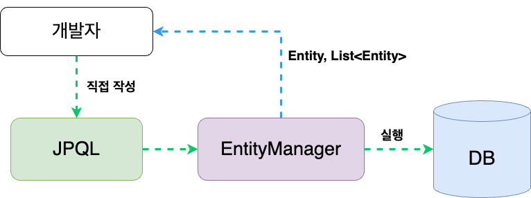

# N+1 문제, Query DSL

## 날짜: 2025-03-20

### 스크럼
- 목표 1 : Query DSL
- 목표 2 : api 명세서대로 백엔드 코드 작성

### 새로 배운 내용
# N+1 문제

= 한 번의 조회로 주 엔티티 N개를 가져왔을 때 각각의 연관 엔티티를 다시 조회하는 쿼리가 N번 추가 실행되어 총(N+1)번 쿼리가 발생

> 해결책으로 lazy loading 하긴 하지만 근본적인 해결 방법은 ㄴㄴ
> 

<원인>

- 패러다임 불일치

<해결 방법>

1. **페치 조인(Fetch Join)**
2. **배치 사이즈(Batch Size)**
3. **엔티티 그래프(Entity Graph)**
    - 스프링 데이터 JPA 등에서 `@EntityGraph` 활용. 특정 속성을 즉시 로딩(EAGER)처럼 동작시키되, 필요하지 않은 부분은 여전히 Lazy
4. **쿼리 튜닝 / Native Query**
    - Native SQL로 한 번에 가져오도록 처리

## **페치 조인(Fetch Join)**

= JPQL에서 `JOIN FETCH`를 사용해 **연관 엔티티를 함께 조회**

→ 필요한 데이터 모두 조인하여 한 방 쿼리로 로드

<단점>

- 무조건 즉시 로딩
- join이 많아지면 쿼리가 복잡해지고, 중복 데이터 발생 가능
- 여러 컬렉션 동치 fetch 불가능 ⇒  카테시안 곱 발생
    
    <aside>
    🎀
    
    **카테시안 곱(Cartesian Product)**
    
    From절에 2개 이상의 Table이 있을때 두 Table 사이에 **유효 join 조건을 적지 않았을때** 해당 테이블에 대한 **모든 데이터를 전부 결합하여 Table에 존재하는 행 갯수를 곱한 만큼의 결과값이 반환**되는 것이다.
    
    </aside>
    

여러 컬렉션을 조인해야 할 경우, 첫 번째 쿼리에서 Root Entity와 1개의 컬렉션을 페치 조인하고, 두 번째 쿼리에서 `WHERE IN` 절과 배치 사이즈를 활용해 나머지 컬렉션을 로딩하세요. 이렇게 분할하면 카테시안 곱 문제를 회피하면서 N+1을 방지할 수 있습니다.

## **배치 사이즈(Batch Size)**

= 지연 로딩 시 한 번에 로딩할 연관 엔티티 수를 제한  (근본적인 해결책 ㄴㄴ)

⇒ 쿼리 실행 수를 줄임 

- `@BatchSize(size = 100)`
- 📈너무 큰 배치 사이즈는 ☹️쿼리 성능 약화…  📉너무 작은 배치 사이즈는 🙅‍♀️N+1 문제 해결 안됨….

(단순히 데이터 출력할 때 사용)

## FetchMode.SUBSELECT

= 모아서 한 번에 처리

→ subquery는 안티패턴임….. 성능이 안좋아짐…

<aside>
🎀

**안티패턴**

소프트웨어 설계에서 비효율적이거나 생산성이 떨어지는 패턴

</aside>

<장점>

- 일대다의 **N+1**을 Subselect 한 번으로 해결
- Batch Size 설정 없이도 묶음 로딩 가능
- Fetch Join + FetchMode.SUBSELECT 혼합은 권장되지 않음. 1차로 fetch join으로 주 엔티티 + 1개 컬렉션만 가져오고, 다른 컬렉션은 subselect or batch size로 해결하는 식으로 전략 분할이 유효.

<aside>
🎀

**Hibernate** 

자바 언어를 위한 객체 관계 매핑(ORM) 프레임워크

= jpa 구현체. jpa는 로직이고 hibernate는 실체

</aside>

# QueryDSL

(Domain Specific Language)

= 자바 코드로 SQL/JPQL을 작성하도록 지원하는 외부 라이브러리

<aside>
🎀

**JPQL**
= 패러다임 불일치를 좀 해결하고 객체지향적 컨셉을 가진 SQL문



</aside>

<장>

- 컴파일 타임 에러(오탈자・타입 불일치) 미리 파악 가능
- 동적 쿼리를 `BooleanBuilder`, `Predicate`, `BooleanExpression`을 사용해 제공 → 가독성/유연성↑
- JPQL 표준 준수
    - 내부적으로 JPQL(혹은 Native SQL) 생성, DB 이식성 지키면서도 코드 가독성 향상
- 가독성 & 유지보수
    - JPQL/SQL 문자열을 직접 이어붙이지 않고, 체이닝 메서드로 작성
        
        <aside>
        🎀
        
        메서드 체이닝
        
        (method chaining)
        
        ```java
        //일반
        store.enter(2);
        store.leave(1);
        store.enter(2);
        
        //메서드 체이닝
        store.enter(2).leave(1).enter(2);
        ```
        
        </aside>
        
    - IDE 자동 완성으로 쿼리 필드 선택
    - `QMember.member` 등 QClass로 필드를 참조하므로, 필드명 오타 위험 감소

## QueryDSL 설정 및 사용 방법

### Q-Class 생성

- **Q-Class**: 컴파일 시점에 엔티티 정보를 분석해 만들어지는 **메타모델 클래스**

<aside>
🎀

**쿼리(Query)**

데이터베이스에서 특정 데이터를 가져오는 요청

</aside>

## 동적 쿼리

QueryDSL에서의 제일 많이 쓰이고 중요한 기능!

= 프로그램이 실행되는(런타임) 동안 생성되고 실행되는 SQL문

→ SQL 문장을 실행 중에 조립하는 기법

> **쿼리문을 String으로 만들어 변수화**
> 

<사용 이유>

- 상황에 따라 다른 문법의 SQL을 적용할 수 있다.

<사용 방법>

**BooleanBuilder**

- 직관적 if문 구조, 조건 많아지면 가독성 떨어질 수 있음
- if... builder.and(...) 반복

```java
BooleanBuilder builder = new BooleanBuilder();
if(name != null) {
    builder.and(member.name.eq(name));
}
if(age != null) {
    builder.and(member.age.goe(age));
}
List<Member> result = queryFactory
    .selectFrom(member)
    .where(builder)
    .fetch();

```

**where() 체이닝**

- `BooleanExpression`을 반환하는 조건 메서드를 사용하며, `null`이 반환되면 해당 조건이 자동으로 무시
- 여러 `Predicate`를 가변 인자로 넘김
- `Optional` or Java8 람다로 더욱 **깔끔하게 사용**

```java
public BooleanExpression nameEq(String name) {
    return name != null ? member.name.eq(name) : null;
}

public BooleanExpression ageGoe(Integer age) {
    return age != null ? member.age.goe(age) : null;
}

List<Member> result = queryFactory
    .selectFrom(member)
    .where(nameEq(paramName), ageGoe(paramAge))
    .fetch();

```

## JPQL과 QueryDSL의 비교

### JPQL

= JPA의 일부 / 쿼리를 객체(엔티티) 기준으로 작성

- EntityManager 활용
- repository interface 활용

<단>

1. 문자열 형태이기 때문에 개발자 의존적
2. 컴파일 단계에서 type-check X
3. 런타임 단계에서 오류 발견..

### QueryDSL

= 정적 타입을 이용해서 SQL, JPQL을 코드로 작성할 수 있도록 도와주는 **오픈소스 빌더 API**

→ JPQL의 보완!

- 모든 쿼리에 대한 내용이 **함수 형태**로 제공

|  | JPQL | QueryDSL |
| --- | --- | --- |
| 정의 | JPA의 일부인 **객체지향 쿼리 언어** | SQL, JPQL을 코드로 작성할 수 있도록 도와주는 **오픈소스 빌더 API** |
| 쿼리(객체(entity)) 작성 형태 | 문자열 | 함수 |
| 컴파일 단계에서 문법 오류 체크 | 🅾️ | ❎ |s

### 오늘의 회고
- 동기부여가 많이 된 날이었다. 수많은 개발자들 사이에서 내가 얼마나 영향력이 있고 돋보일지 아무도 모른다. 위로 가기 위해서는 열심히 하는 수 밖에 없다. 나는 위로 갈거다. 

### 참고 자료 및 링크

