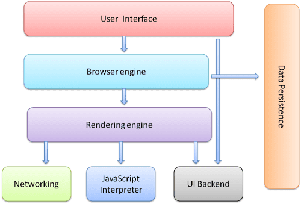
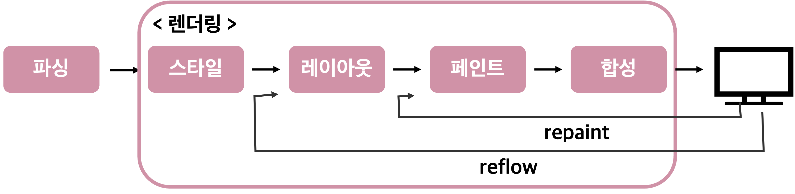
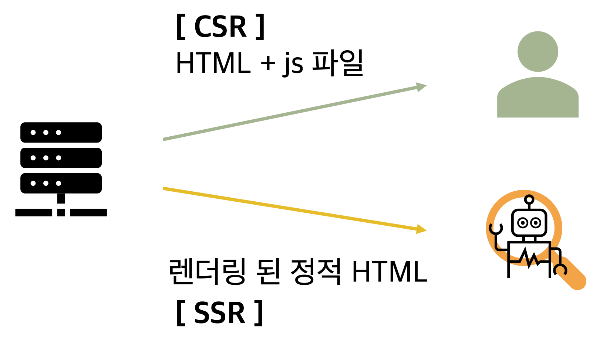

# 제목

## 날짜: 2025-03-21

### 스크럼
- 목표 1 :


### 새로 배운 내용
# 1. VanilaJS로 Virtual DOM을 구현하는 방법

> 리액트에서의 virtual DOM을 vanilaJS에서도 사용할 수 있다고한다. 이 방법을 알아보기 위해서 먼저, 브라우저 동작방식에 대해 알아보고, 가상돔이 무엇인지 알아보자.
> 

## 브라우저 동작 방식

<aside>
🎀

**브라우저(Browser)**

인터넷에서 웹 서버의 모든 정보를 볼 수 있도록 하고, 문서 검색을 도와주는 응용 프로그램

</aside>

<브라우저 구성 요소>

1. **사용자 인터페이스(UI)**: 주소 표시줄, 뒤로가기/앞으로가기, 북마크 메뉴…  요청된 페이지가 표시되는 창을 제외한 브라우저의 모든 부분
2. **브라우저 엔진**: UI와 렌더링 엔진 간의 작업을 마샬링
    
    <aside>
    🎀
    
    **마샬링(Marshalling)**
    
    객체의 데이터 포맷을 변경하여 메모리에 표현하거나 파일로 저장하거나 네트워크로 전송하는 과정
    
    </aside>
    
3. **⭐️렌더링 엔진**: 요청된 콘텐츠를 표시(ex. HTML 및 CSS를 파싱&화면에 표시)
4. **네트워킹**:  ex. HTTP 요청과 같은 네트워크 호출
5. **UI 백엔드**
6. **JavaScript 인터프리터:** JavaScript 코드를 파싱 & 실행
7. **데이터 스토리지:** 쿠키와 같은 데이터를 로컬에 저장



> Chrome과 같은 브라우저는 렌더링 엔진의 인스턴스를 여러 개 실행합니다(탭마다 하나씩). 각 탭은 별도의 프로세스에서 실행됩니다.
> 

<브라우저 로딩 과정>



1. 파싱(Parsing):  DOM tree, CSSOM tree 구성
2. 스타일(Style):  두 트리를 매칭시켜 render tree 구성
3. 레이아웃(Layout):  render tree의 각 노드의 위치와 크기 계산
4. 페인트(Paint): 각 노드를 화면에 픽셀화
5. 합성(Composition):  페인트된 각 레이어를 합침.(+필요시에만 일어남(ex. `transform`, `opacity`))

⇒ 여기서 **reflow**가 가장 성능을 많이 잡아먹는다! 그래서 등장한 개념이 바로..

## 가상돔(Virtual DOM)

> DOM 조작에 대한 복잡도가 계속 증가하고 있다…. 브라우저 연산량이 너무 많아지고 있다!!
> 

= 뷰(HTML)에 변화가 있을 때, 구 가상돔(Old Node)과 새 가상돔(New Node)을 비교하여 **변경된 내용만 DOM에 적용**

→ 전체 DOM을 바꾸지 않고 필요한 것마 대체할 수 있음.

DOM 형태를 본 딴 객체.

<장점>

- 브라우저 환경이 아니더라도 사용할 수 있음.
- 테스트 용이

```jsx
//jsx가 h() 호출로 변환됨(커스텀 JSX pragma)
/** @jsx h */
function h(type, props, ...children) {
  return { type, props, children: children.flat() }
}

//virtualDOM을 realDOM으로 만들기
function createElement(node) {
  if (typeof node === 'string') {
    return document.createTextNode(node);
  }
  Object.entries(node.props || {})
        .filter(([attr, value]) => value)
        .forEach(([attr, value]) => (
          $el.setAttribute(attr, value)
        ));
  const $el = document.createElement(node.type);
  node.childre.map(createElement)
              .forEach(child => $el.appendChild(child));
  return $el;
}

//데이터
const state = [
  { id: 1, completed: false, content: 'todo list item 1' },
  { id: 2, completed: true, content: 'todo list item 2' },
];

//jsx를 사용해서 virtualDOM 구성하기
const realDom = createElement(
  <div id="app">
    <ul>
      { state.map(({ completed, content }) => (
        <li class={completed ? 'completed' : null}>
          <input type="checkbox" class="toggle" checked={completed} />
          { content }
          <button class="remove">삭제</button>
        </li>
      )) }
    </ul>
    <form>
      <input type="text" />
      <button type="submit">추가</button>
    </form>
  </div>
);
```

위의 코드는 기본적인 virtualDOM이고 실질적인 성능 개선은 없다. 성능 개선을 위해서는 DIffing 알고리즘을 적용해야한다.

## Diffing 알고리즘

= 실제 DOM과 Virtual DOM을 비교하여 변경된 부분만 실제 DOM에 반영할 때, 이 **변경된 부분을 찾아내는** 알고리즘

→ 모든 노드들을 탐색하면서 자식 노드들의 개수 등으로 변화를 탐지한다. 

`node.nodeType`

`node.attributes`

`node.childNodes`

`node.isEqualNode`

`node.hasChildNodes`

<aside>
🎀

결론적으로

- Virtual DOM은 매번 전체 페이지를 다시 그리는 대신
- “이전 VDOM ↔ 새 VDOM”을 비교(diff)해서
- 오직 **변경된 부분만** 실제 DOM에 **적용(patch)**합니다.

👉 결과적으로 불필요한 Reflow/Repaint를 줄여 렌더링 비용을 절약

</aside>

## VanilaJS로 virtual DOM 사용하기

> 아쉽지만 가독성이 매우 좋지 않다.
> 

DOM을 메모리상에만 올려놓고 값을 변경하는 작업을 하자.

1. node 생성
    - 💻 코드
        
        ```jsx
        // text를 node로 변환하는 작업이다.
        const render = (state) => {
          // 빈 태그를 하나 만든다.
          const el = document.createElement('div');
        
          // 안에 내용을 채워넣는다.
          el.innerHTML = `
            <div id="app">
              ...
            </div>
          `.trim();   //문자열 양 끝의 공백을 제거
        
          // innerHTML에 등장한 첫 번째 태그를 반환한다.
          return el.firstChild;
        }
        ```
        
2. diff 알고리즘 작성
    - 💻 코드
        
        ```jsx
        function updateElement (parent, newNode, oldNode) {
          **// 안바뀌었으면 그냥 냅둠**
          // 1. oldNode만 있는 경우 -> 모두 삭제
          if (!newNode && oldNode) {
            return oldNode.remove();
          }
          
          **// 모두 바뀐 경우**
          // 2. newNode만 있는 경우 -> 모두 추가
          if (newNode && !oldNode) {
            return parent.appendChild(newNode);
          }
        
          **// 바뀌었는지 비교**
          // 3. oldNode와 newNode 모두 text 타입일 경우
          if ( newNode instanceof Text && oldNode instanceof Text) {
            // Text일 경우 nodeValue로 값 비교가 가능하다.
            if (oldNode.nodeValue === newNode.nodeValue) return;
        
            // nodeValue의 값을 변경해준다.
            oldNode.nodeValue = newNode.nodeValue
            return;
          }
        
          // 4. oldNode와 newNode의 태그 이름이 다를 경우
          if (newNode.nodeName !== oldNode.nodeName) {
            const index = [ ...parent.childNodes ].indexOf(oldNode);
            return (
        			oldNode.remove(),
              parent.insertBefore(newNode, parent.children[index] || null)
            ); // undefined를 반환할 것이다.
          }
        
          // 5. oldNode와 newNode의 태그 이름(type)이 같을 경우
          // 가상돔(VirtualDOM)의 props를 넘기는게 아니기 때문에 oldNode와 newNode를 직접 넘긴다.
          updateAttributes(oldNode, newNode);
          
          **// child 탐색하며 끝까지 반복**
          // 6. newNode와 oldNode의 모든 자식 태그를 순회하며 1 ~ 5의 내용을 반복한다.
          // 일단 childNodes를 배열로 변환해야한다.
          const newChildren = [ ...newNode.childNodes ]; 
          const oldChildren = [ ...oldNode.childNodes ];
          const maxLength = Math.max(newChildren.length, oldChildren.length);
          for (let i = 0; i < maxLength; i++) {
            updateElement(oldNode, newChildren[i], oldChildren[i]);
          }
        }
        
        function updateAttributes(oldNode, newNode) {
        	const oldProps = [ ...oldNode.attributes ];
        	const newProps = [ ...newNode.attributes ];
        	
        	// 달라지거나 추가된 Props를 반영
        	for (const {name, value} of newProps) {
        	  if (value === oldNode.getAttribute(name)) continue;
        	  oldNode.setAttribute(name, value);
        	}
        	
        	// 없어진 props를 attribute에서 제거
        	for (const {name} of oldProps) {
        	  if (newNode.getAttribute(name) !== undefined) continue;
        	  oldNode.removeAttribute(name);
        	}
        }
        ```
        
3. 컴포넌트에 추가
    - 💻 코드
        
        ```jsx
        class Component {
          $target; $state;
          
          constructor ($target) { 
            this.$target = $target;
            this.setup();
            this.render();
          }
          setup () {};
          template () { return ''; }
          
          **// 렌더링**
          render () {
            const { $target } = this;
            
            // 기존 Node를 복제한 후에 새로운 템플릿을 채워넣는다.
            const newNode = $target.cloneNode(true);
            newNode.innerHTML = this.template();
            
            // DIFF알고리즘을 적용한다.
            const oldChildNodes = [ ...$target.childNodes ];
            const newChildNodes = [ ...newNode.childNodes ];
            const max = Math.max(oldChildNodes.length, newChildNodes.length);
            for (let i = 0; i < max; i++) {
              updateElement($target, newChildNodes[i], oldChildNodes[i]);
            }
        
            // 이벤트를 등록한다.
            this.setEvent();
          }
        
          setEvent () {}
          setState (newState) {
            this.$state = { ...this.$state, ...newState };
            this.render();  **//새로이 setState()할 때마다 렌더링 실행**
          }
        }
        ```
        

<주요 고려 요소>

1. virtualDOM 데이터 구조
    - text 노드와 요소 노드 구분하기
        - text이면 단순히 `.nodeValue` 비교
        - 요소이면, 태그 비교 후 다르면 걍 대체. 같으면 일일이 비교
2. virtualDOM을 realDOM으로 만들기
    - text 노드와 요소 노드 구분하기
3. diffing 알고리즘
    - DFS(깊이 우선 탐색) + O(n) 권장
    - **Lazy Evaluation**: 비교 필요 없는 노드들 패스
4. Patch 적용 전략
    - **Lazy Evaluation**: 여러 변경점을 모아서 한 번만 DOM 조작
    - `requestAnimationFrame` , `requestIdleCallback` 사용해서 this 바인딩 이슈 해결

---

# 2. SPA에서의 SEO 이슈와 대응방법

<aside>
🎀

**SPA(Single Page Application)**

다수의 페이지를 표시하는 데 있어서 마치 하나의 페이지인 것처럼 처리하는 기술

- 서버에서 필요한 데이터만 비동기로 받아와서 동적으로 현재 화면에 다시 렌더링 하는 방식
</aside>

<aside>
🎀

**SEO(Search Engine Optimization)**

웹사이트가 검색 결과에 더 잘 보이도록 최적화하는 과정

</aside>

먼저, 웹사이트가 검색 엔진에 노출되는 방식에 대해 알아야 한다.

1. url 등을 통해 사이트를 탐색
2. 🚨주로 **HTML 파일**을 읽음     → 문제 발생!!
3. 키워드가 맞으면 노출

SPA의 경우, 필요한 내용을 js를 통해 바꿔준다.  → 이 내용은 검색 엔진이 서치하지 못한다!

<대응 방법>

### SSR

(Server Side Rendering)

렌더링을 서버에 요청해서 서버가 렌더링 해 줌

1. 서버에서 렌더링 해주면 (화면 볼 수 있음)
2. js 다운로드하고
3. 동적요소 실행하도록 화면 구성(사용자 응답 가능)

→ 처음 설계부터 ssr로 해야 됨.

### Pre-Rendering

서버에서 실제 검색 엔진을 판단해서 렌더링된 정적 HTML을 전달해 줌
ß
즉, 선택적으로 SSR함.



→ 완성된 페이지에 적용 가능(플러그인이나 라이브러리 사용(ex. react-helmet))

### History API

렌더링 이전, 이후 페이지에 대한 URL을 만들어 줌.

→ spa 이더라도 URL이 여러 개 생김 → 검색 엔진이 서치할 수 있음! 

---

# 참고 문헌

https://web.dev/articles/howbrowserswork?hl=ko

https://devocean.sk.com/blog/techBoardDetail.do?ID=165601

https://smartsolar.tistory.com/entry/SPASingle-Page-Application-SEO-%EB%B0%A9%EB%B2%95-%EC%A0%95%EB%A6%AC-by-%EB%B9%84%EA%B0%9C%EB%B0%9C%EC%9E%90

### 오늘의 회고
- 

### 참고 자료 및 링크

