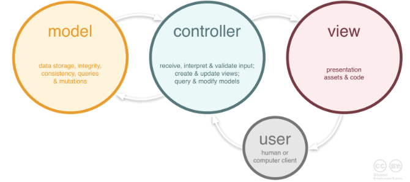
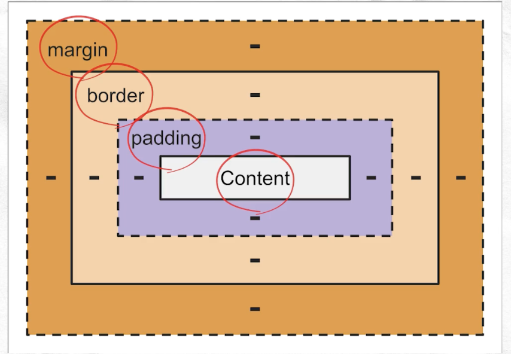

# HTML, CSS, JS

## 날짜: 2025-01-30

### 스크럼
- 학습 목표 1 : 웹 기초 강의 듣고 정리
- 학습 목표 2 : CLI 프로그램 개발

### 새로 배운 내용
#### MVC 패턴  
프로젝트의 구성 요소가 Model-View-Controller 구조
디자인 패턴 중 하나!

- model : 데이터 관리
    - 사용자가 편집하길 원하는 데이터를 모두 가지고 있어야 한다.
    - view나 controller의 내용을 직접 수정하면 안된다.
    - 변경 발생 시, 그리고 변경 통지 시에 대한 처리방법을 구현해야만 한다.
- view : UI
    - 모델의 정보를 따로 저장해는 안된다.
    - model이나 controller를 참조해서는 안된다.
    - 변경 발생 시, 그리고 변경 통지 시에 대한 처리방법을 구현해야만 한다.
- controller : model과 view 사이를 연결하는 로직
    - model과 view에 대해 알고 있어야 한다.
    - model과 view의 변경을 모니터링 해야 한다.
[사용 이유]
- 서버 부하 감소
- 애플리케이션의 유지 보수성, 확장성, 유연성 증가
    > 유연성 : 클라이언트의 새로운 요구에 대해 최소한의 비용으로 대처

#### HTML  
HyperText Markup Language
- 웹 페이지의 구조를 정의하기 위한 언어
> Markup 언어 : 문서의 구조를 표현하는 언어
> Markdown 언어 : Markup 언어의 하위 개념. 간단함 Markup 언어

#### CSS  
Cascading Style Sheets
- 웹 문서의 __스타일__ 을 정해둔 시트
    - class 선택자 : 한 페이지 내에서 중복 사용 __가능__
        - 반복되는 태그들을 한 번에 변경
        - -> .style{} 
    - ID 선택자 : 한 페이지 내에서 중복 사용 __불가능__
        - 페이지 내 유일한 것을 지정
        - -> #style{}

##### boxmodel  

- content : 요소의 실질적인 내용
- padding : 요소의 내부(요소와 테두리 사이) 여백
- border : 요소의 테두리
- margin : 요소의 외부(내 요소와 다른 요소 사이) 여백

##### flex  
웹 페이지의 요소를 유연하게 배치하고 조절할 수 있게하는 레이아웃
- 다양한 화면 크기에 대해 자동 배치
- 자식 요소(flex item)은 부모 컨테이너(flex container) 내에서 유연하게 배치됨
    - flex container에
        `display: flex;`
    - flex item에
        `flex-direction: row;       //item이 쌓이는 방향`
        `align-items: flex-start;   //전체 item의 세로 상 위치`
        `flex-grow: 1;              //flex container 내에서 하나의 item이 할당 받을 크기의 정도 설정`
        `flex-wrap: wrap;           //flex container의 크기가 부족할 때 item의 줄 넘김 처리`
- _internet explore 11에서는 표준 스펙 지원_

##### grid  
flex와 비슷하지만 2차원 형식, row, colum 두 방향으로 설정 가능
    - grid container에
        `display: grid;`
    - grid item에
        `grid-template-columns: 200px 200px 500px   //가로`
        `grid-template-rows: 200px 200px 500px      //세로`

#### JavaScript  
##### DOM  
(Document Object Model)
- HTML 코드가 브라우저에 의해 파싱되어 메모리 상에 형성된 객체 구조
- js가 붙어서 웹 페이지의 동적 조작
    > 동적 조작 : 페이지 로드 후에도 사용자와의 인터렉션을 통해 페이지가 바뀔 수 있음
1. 브라우저는 웹 서버로부터 .html -> .byte
2. .byte -> text 문자
3. text 문자 -> token
4. token -> node
5. node들이 모여 dom tree 형성
    > token : 문자열의 작은 단위    -> 의미를 가지지 않음
    > node : token 묶음의 객체    -> 계층 구조를 가짐
    > dom : 전체적인 문서 __구조__

##### CSSOM  
(CSS Object Model)
- CSS 코드가 브라우저에 의해 파싱되어 메모리 상에 형성된 객체 구조
- DOM과 비슷하지만 __스타일__ 에 집중
- js가 붙어서 웹 페이지의 동적 조작
1. 브라우저는 웹 서버로부터 .css -> .byte
2. .byte -> text 문자
3. text 문자 -> token
4. token들이 모여 cssom tree 형성

##### event  
사용자가 웹 페이지에서 하는 동작
- EventListener : event 발생 시 알려줌
- EventHandler : event 발생 후 실행할 동작
`document.getElementById('엘리먼트아이디').addEventListener('click',()=>{alert("요소 클릭");});`

##### fetch  
서버에게 데이터를 비동기적으로 요청하고 수신하는 과정  
> 비동기(asynchorous) : 요청과 결과가 동시에 일어나지 않고 딜레이가 있음
`fetch('URL')
	.then()
	...
	.catch() //오류 처리`

#### SEO  
(Search Engine Optimization)
- 홍보
- 웹 사이트를 검색 엔진이 더 잘 찾을 수 있도록 하는 기술
    1. 적절한 키워드 선택
    2. 모바일 친화적 구조
    3. 백링크 구축
        > 백링크 : 다른 웹사이트가 자사 웹사이트를 언급해주는 것
    4. sns 활용

### 오늘의 도전 과제와 해결 방법

### 오늘의 회고
- 아침에 일찍 일어나지 못해서 스크럼에 참여하지 못했다... 이틀 연속은 내가 생각해도 너무하다... 내일은 기필코 일찍 일어나야겠다.
- 틈틈히 시간을 내서 공부할 목표를 모두 했다.

### 참고 자료 및 링크